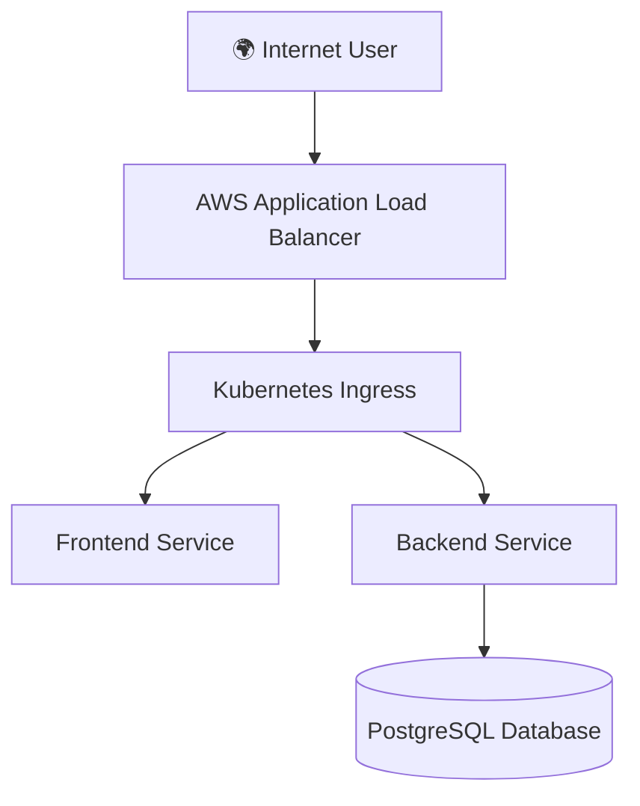

# 🚀 End-to-End Fintech Microservices Platform

## 📌 Project Overview

This project demonstrates a production-style **Fintech Microservices Application** deployed using:

* Docker & Docker Compose (Local Development)
* Kubernetes (Minikube)
* Amazon EKS (Cloud Production)
* AWS Load Balancer (Public Access)

The goal of this project is to simulate a real-world DevOps workflow including:

* Containerization
* Kubernetes orchestration
* Cloud deployment
* Infrastructure scaling
* CI/CD readiness

---

# 🏗️ Architecture Overview

## 🔹 High Level Architecture (AWS Deployment)



---

# 🧱 Tech Stack

## 🖥️ Frontend

* React (or static web app)
* Served via Kubernetes Service

## ⚙️ Backend

* FastAPI / Node.js (API Layer)
* REST APIs
* Connected to PostgreSQL

## 🗄️ Database

* PostgreSQL
* Kubernetes Deployment
* Persistent Volume support

## ☁️ Cloud Infrastructure

* Amazon EKS
* Amazon ECR
* Application Load Balancer
* IAM Roles
* VPC + Subnets

---

# 📂 Project Structure

```
FinBank/
│
├── backend/
│   ├── Dockerfile
│   └── app/
│
├── frontend/
│   ├── Dockerfile
│   └── src/
│
├── k8s/
│   ├── backend-deployment.yaml
│   ├── frontend-deployment.yaml
│   ├── postgres-deployment.yaml
│   ├── services.yaml
│   └── ingress.yaml
│
└── docker-compose.yml
```

---

# 🐳 Phase 1 – Local Development (Docker)

## Build Containers

```bash
docker build -t finbank-backend ./backend
docker build -t finbank-frontend ./frontend
```

## Run with Docker Compose

```bash
docker-compose up --build
```

---

# ☸️ Phase 2 – Kubernetes (Minikube)

## Start Cluster

```bash
minikube start
```

## Apply Kubernetes Manifests

```bash
kubectl apply -f k8s/
```

## Check Pods

```bash
kubectl get pods
kubectl get svc
```

## Access App

```bash
minikube service frontend-service
```

---

# ☁️ Phase 3 – Production Deployment (Amazon EKS)

## 1️⃣ Push Images to ECR

```bash
aws ecr create-repository --repository-name finbank-backend
aws ecr create-repository --repository-name finbank-frontend
```

Tag & Push:

```bash
docker tag finbank-backend:latest <account-id>.dkr.ecr.<region>.amazonaws.com/finbank-backend
docker push <account-id>.dkr.ecr.<region>.amazonaws.com/finbank-backend
```

---

## 2️⃣ Create EKS Cluster

```bash
eksctl create cluster \
  --name finbank-cluster \
  --region ap-south-1 \
  --nodes 2
```

---

## 3️⃣ Deploy to EKS

Update image URLs in manifests to ECR image paths.

```bash
kubectl apply -f k8s/
```

---

## 4️⃣ Enable Public Access

Use:

* Kubernetes Service type: LoadBalancer
  OR
* Kubernetes Ingress with AWS Load Balancer Controller

Check External URL:

```bash
kubectl get svc
kubectl get ingress
```

---

# 🔐 Production Hardening

* Use Kubernetes Secrets for DB credentials
* Use ConfigMaps for environment variables
* Add Readiness & Liveness Probes
* Add Resource Requests & Limits
* Enable Horizontal Pod Autoscaler

---

# 📈 Scalability Design

* Frontend & Backend are stateless
* Can scale using:

```bash
kubectl scale deployment backend --replicas=3
```

* Load Balancer distributes traffic

---

# 🛡️ Security Considerations

* IAM Roles for Service Accounts
* Private Subnets for worker nodes
* Security Groups
* No hardcoded credentials

---

# 🔄 Future Improvements

* Add CI/CD pipeline (GitHub Actions)
* Add Terraform Infrastructure as Code
* Add Monitoring (Prometheus + Grafana)
* Add Logging (ELK Stack)

---

# 🎯 Key DevOps Concepts Demonstrated

* Containerization
* Kubernetes Orchestration
* Cloud Deployment
* Microservices Architecture
* Infrastructure Scaling
* Production Deployment Strategy

---

# 👨‍💻 Author

Siddarthareddy Chitiki
Cloud & DevOps Engineer

"Building Scalable Cloud Infrastructure"

---

# ⭐ If You Like This Project

Give it a star on GitHub and connect for collaboration!

